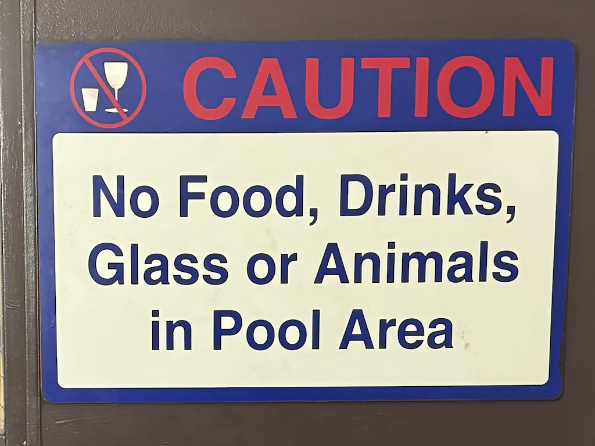
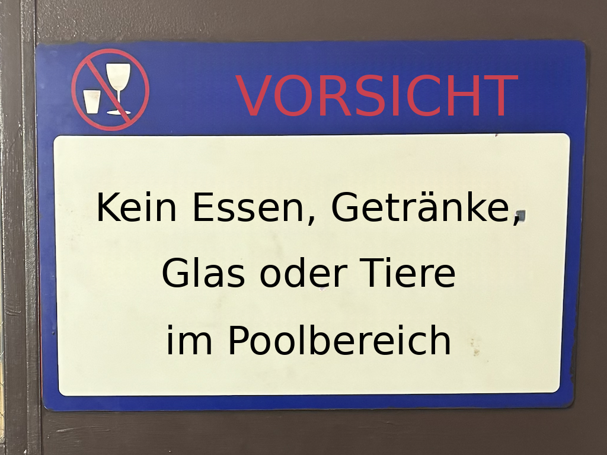
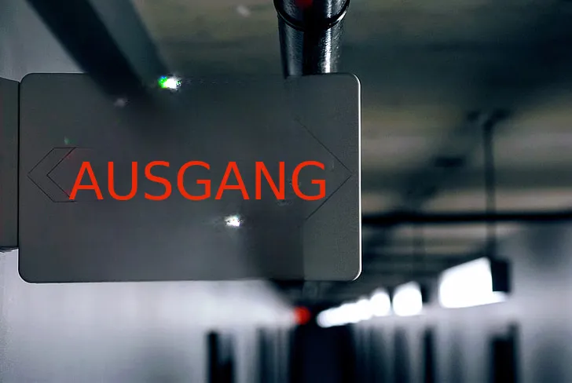
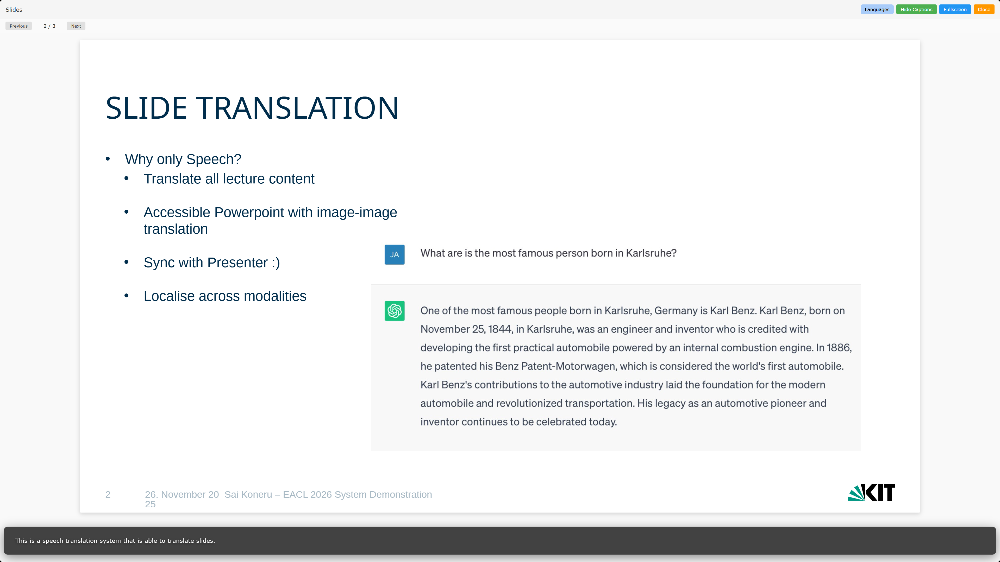
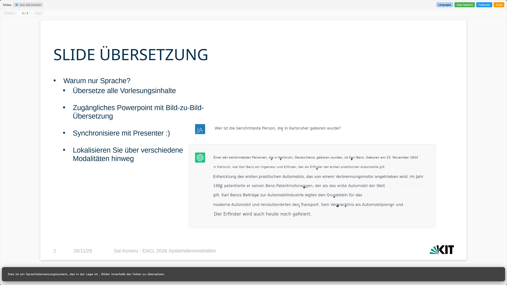

## Update 

[](https://2026.eacl.org/)
[](https://arxiv.org/abs/2512.02817)

This work was accepted for presentation in the **System Demonstrations** track at the EACL 2026

### Looking for Support/Collaboration

Seeking collaborators for advice/building/improving **rendering**. Specifically, model-based approach for text rendering using the translations and the original font. I personally hate the current vibe-coded heuristic-based and quantum level uncertainitity on how it will look in complicated images. If this topic is exciting for you and have time to spare, please send me a email!

# Image Translator

A modular image translation pipeline that translates text inside images while preserving layout and style.

## Features

- **Modular Architecture**: Independent workers for OCR, segmentation, inpainting, and translation
- **Docker-based**: Each worker runs in its own container
- **Extensible**: Easy to add custom workers or replace existing ones
- **Multi-language Support**: Translate between multiple languages
- **Rule-based Style Preservation**: Aims to maintains original text styling (font, color, position)

## Examples


| Source Image | Translated Image |
|--------------|------------------|
|  |  |
|  |  |
|  |  |
|  |  |

## Pipeline Design

```
Input Image
    ↓
[OCR] → Text + Bounding Boxes
    ↓
[Layout] → Paragraph Boundaries
    ↓
[Segmentation] → Translation Units
    ↓
[Inpainting] → Text Removed
    ↓
[Translation] → Translated Text
    ↓
[Rendering] → Final Translated Image
```

## Quick Start

### Prerequisites
- Docker & Docker Compose
- Python 3.9+

### Installation

1. **Clone the repository:**
```bash
git clone https://github.com/saikoneru/image-translator.git
cd image-translator
```

2. **Download Layout Models:**
   
   The layout worker requires HiSAM models. Download both:
   - **HiSAM checkpoint** from [HiSAM checkpoint](https://github.com/ymy-k/Hi-SAM?tab=readme-ov-file#pushpin-checkpoints)
   - **SAM ViT-H image encoder** (see NOTE in HiSAM README)
   
   Place downloaded models in `models/` directory at project root:
   ```
   models/
   ├── hisam_checkpoint.pth
   └── sam_vit_h_encoder.pth
   ```

3. **Start all services:**
```bash
docker compose up --build
```

## API Endpoints

### Image Translation

```bash
POST /translate/image
```
Translate text in an image.

**Parameters:**
- `file` (image file): Image to translate
- `src_lang` (string): Source language code
- `tgt_lang` (string): Target language code

**Example:**
```bash
curl -X POST http://localhost:5000/translate/image \
  -F "file=@image.jpg" \
  -F "src_lang=en" \
  -F "tgt_lang=de"
```

**Response:** PNG image with translated text

---

### PowerPoint Translation

```bash
POST /translate/pptx
```
Translate PowerPoint presentations.

**Parameters:**
- `file` (PPTX file): Presentation to translate
- `src_lang` (string): Source language
- `tgt_lang` (string): Target language
- `output_format` (string, optional): "pdf" or "pptx" (default: "pdf")
- `translate_master` (bool, optional): Translate master slides (default: true)
- `translate_images` (bool, optional): Translate images in slides (default: true)

**Example:**
```bash
curl -X POST http://localhost:5000/translate/pptx \
  -F "file=@presentation.pptx" \
  -F "src_lang=en" \
  -F "tgt_lang=fr" \
  -F "output_format=pdf"
```

**Response:** PDF or PPTX file

---

### Auto-detect Translation

```bash
POST /translate/auto
```
Auto-detect file type and translate.

**Supported formats:** PNG, JPG, JPEG, GIF, BMP, PPTX

**Parameters:**
- `file` (file): Document to translate
- `src_lang` (string): Source language
- `tgt_lang` (string): Target language
- `output_format` (string, optional): "auto", "pdf", or "pptx"
- `translate_master` (bool, optional): For PPTX only
- `translate_images` (bool, optional): For PPTX only

**Example:**
```bash
curl -X POST http://localhost:5000/translate/auto \
  -F "file=@document.pptx" \
  -F "src_lang=en" \
  -F "tgt_lang=es"
```

---

### Streaming PowerPoint Translation

```bash
POST /translate/pptx/sse
```
Translate PPTX with real-time progress updates via Server-Sent Events.

**Parameters:** Same as `/translate/pptx`

**Response:** SSE stream with events:
- `status`: Translation started/completed
- `progress`: Current slide number
- `slide`: Completed slide as base64 PDF
- `error`: Error message if failed

**Example:**
```javascript
const eventSource = new EventSource('/translate/pptx/sse');
eventSource.addEventListener('progress', (e) => {
  const data = JSON.parse(e.data);
  console.log(`Slide ${data.slide}/${data.total}`);
});
```

---

### Health Check

```bash
GET /health
```
Check API status.

**Response:**
```json
{"status": "healthy"}
```

## Docker Management

### Start Services
```bash
docker compose up -d              # All services
docker compose up ocr-worker      # Single worker
```

### View Logs
```bash
docker compose logs -f
```

### Stop Services
```bash
docker compose down       # Stop containers
docker compose down -v    # Stop and remove volumes
```

## Creating Custom Workers

### 1. Create Worker Structure
```
workers/your_worker/
├── Dockerfile
├── requirements.txt
├── worker.py
└── README.md
```

### 2. Implement Worker
```python
from fastapi import FastAPI, UploadFile
import uvicorn, os

app = FastAPI(title="Custom Worker")

@app.post("/process")
async def process(file: UploadFile):
    # Your logic here
    result = your_processing_function(await file.read())
    return {"success": True, "data": result}

if __name__ == "__main__":
    uvicorn.run(
        app, 
        host=os.getenv("WORKER_HOST", "0.0.0.0"),
        port=int(os.getenv("WORKER_PORT", "8010"))
    )
```

### 3. Add to docker-compose.yml
```yaml
your-worker:
  build: ./workers/your_worker
  ports:
    - "8010:8010"
  environment:
    - WORKER_PORT=8010
```

### 4. Update Pipeline
Add worker URL to your pipeline configuration and integrate into processing flow.

## Acknowledgments

- [PaddleOCR](https://github.com/PaddlePaddle/PaddleOCR)
- [Simple Lama](https://github.com/enesmsahin/simple-lama-inpainting)
- [HiSAM](https://github.com/ymy-k/Hi-SAM)
- [Hugging Face](https://huggingface.co)
- [python-pptx](https://python-pptx.readthedocs.io)

## Contact

For questions or support, please open an issue on [GitHub](https://github.com/saikoneru/image-translator).

## Citation

If you use this work in your research, please cite:

```bibtex
@article{koneru2025boom,
  title={BOOM: Beyond Only One Modality KIT's Multimodal Multilingual Lecture Companion},
  author={Koneru, Sai and Retkowski, Fabian and Huber, Christian and Hilgert, Lukas and Akti, Seymanur and Ugan, Enes Yavuz and Waibel, Alexander and Niehues, Jan},
  journal={arXiv preprint arXiv:2512.02817},
  year={2025}
}


